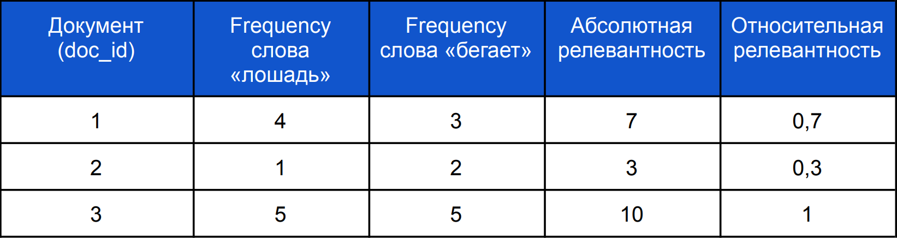
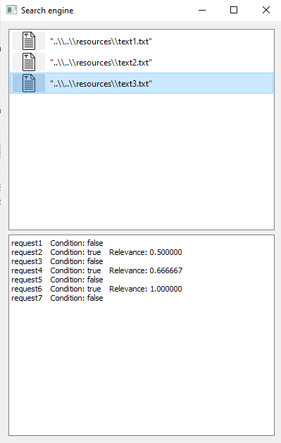

Search Engine
---
## Введение
Данное приложение позволяет отыскать наиболее подходящие текстовые документы по пользовательским запросам. Реализация поискового движка проводилась в качестве завершающего проекта по курсу "Разработчик С++ с нуля" на платформе SkillBox.
## Описание
### 1. Содержание проекта
Проект в своем наполнении состоит в основном из трех файлов формата _json (config.json, requests.json, answers.json)_ и трех классов выведенных в отдельные файлы форматов _.cpp_ и _.h_ _(converterJSON, InvertedIndex, SearchServer)_.
#### 1.1 config.json
Пример файла _config.json_:
```
{
    "config": {
        "name": "SkillboxSearchEngine",
        "version": "0.1",
        "max_responses": 5
    },
    "files": [
        "../resources/file001.txt",
        "../resources/file002.txt",
        "../resources/file003.txt",
        "../resources/file004.txt",
        …
    ]
}
```
- config — общая информация, без которой приложение не запускается. Если это
поле отсутствует, то при старте программа выбросит исключение и
выведет в текстовую консоль ошибку _"config file is empty"_. Если отсутствует сам
файл _config.json_, то выбросится исключение и выведется сообщение об ошибке _"config
file is missing"_.
- name — поле с названием поискового движка.
- version — поле с номером версии поискового движка. В приложении реализован алгоритм 
проверки версии поискового движка. Если поле _version_ не совпадает с версией самого
приложения, то выводится ошибка _"config.json has incorrect file
version"_.
- max_responses — поле, определяющее максимальное количество ответов на
один запрос.
- files содержит пути к файлам, по которым будет осуществляься поиск.
Внутри списка files лежат пути к файлам.
- <путь к файлу>(“../resorces/file001.txt”) — это путь к файлу. По его
содержимому совершается поиск. Если по этому пути файл не
существует, то на экран выводится соответствующая ошибка, но выполнение
программы не прекращается. При этом каждый документ должен содержать не более
1000 слов с максимальной длиной каждого в 100 символов. Слова должны
состоять из строчных латинских букв и разделены одним или несколькими
пробелами.
#### 1.2 requests.json
Пимер файла _requests.json_
```
{
    "requests": [
        "some words..",
        "some words..",
        "some words..",
        "some words..",
        …
    ]
}
```
- requests состоит из списка запросов, которые необходимо обработать
поисковым движком. Поле содержит не более 1000 запросов, каждый из
которых включает от одного до десяти слов.
- <содержимое запроса>(“some words”) — поисковый запрос, набор слов,
разделённых одним или несколькими пробелами. По ним осуществляется поиск. 
Все слова состоят из строчных латинских букв.

#### 1.3 answers.json
Пример файла _answers.json_
```
{
    "answers": {
        "request001": {
            "result": "true",
            "relevance": {
                "docid": 0, “rank” : 0.989,
                "docid": 1, “rank” : 0.897,
                "docid": 2, “rank” : 0.750,
                "docid": 3, “rank” : 0.670,
                "docid": 4, “rank” : 0.561
            }
        },
        "request002": {
            "result": "true",
            "docid": 0, “rank” : 0.769
        },
        "request003": {
            "result": "false"
        }
    }
}
```
- answers — базовое поле в этом файле, которое содержит ответы на запросы.
- request001 … 003 — идентификатор запроса, по которому сформирован ответ.
Идентификатор запроса формируется автоматически по порядку, в котором
находятся запросы в поле requests файла _requests.json_. Например:
```
"requests": [
    "some words..", для данной строки id запроса будет равен “request001”
    "some words..", для данной строки id запроса будет равен “request002”
    "some words..", для данной строки id запроса будет равен “request003”
    "some words..", для данной строки id запроса будет равен “request004”
    …   
]
```
- result – результат поиска запроса. Если он принимает значение _true_, значит по
данному запросу найден хотя бы один документ. Если результат имеет значение
_false_, значит ни одного документа не найдено. Тогда других полей в ответе на
этот запрос нет.
- relevance включается в файл _answers.json_, если на этот запрос удалось найти
более одного документа.
Далее идут соответствия рейтинга ответа и названия _id_ документа, в котором
осуществлялся поиск:
- <Идентификатор документа>("docid") — идентификатор документа, в котором
найден ответ на запрос. Он формируется автоматически при индексации всех
документов исходя из порядка, в котором документы расположены в поле _files_ в
файле _config.json_. Например, если в файле _config.json_ поле _files_ содержит:
```
"files": [
    "../resources/file001.txt", для данного файла docid будет равен 0
    "../resources/file002.txt", для данного файла docid будет равен 1
    "../resources/file003.txt", для данного файла docid будет равен 2
    "../resources/file004.txt", для данного файла docid будет равен 3
    …
]
```
- <ранг ответа>(“rank”) — ранг или поисковый рейтинг. Это число показывает,
насколько документ подходит для заданного запроса. В ответе _id_ документов
располагаются в порядке уменьшения поискового рейтинга.

#### 1.4 Заголовочный файл converterJSON.h

```
class ConfigFileMissingException : public std::exception {
    const char* what() const noexcept override;
};

class ConfigFileEmptyException : public std::exception {
    const char* what() const noexcept override;
};

class ConfigFileEmptyFieldException : public std::exception {
    const char* what() const noexcept override;
};

void checkConfigException(std::ifstream& fileJSON);

void checkConfigException(nlohmann::json& dict);

void checkConfigFilesException(nlohmann::json& dict);

class ConverterJSON {
private:
    std::vector<std::string> vecConfig;
    std::vector<std::string> vecRequests;
    int responses;
    nlohmann::json dictConfig;
    nlohmann::json dictRequests;
    nlohmann::json dictAnswers;
public:
    ConverterJSON();
    std::vector<std::string> GetTextDocuments();
    int GetResponsesLimit();
    std::vector<std::string> GetRequests();
    void putAnswers(std::vector<std::vector<std::pair<int, float>>>& answers);
}
```

##### 1.4.1 Метод GetResponsesLimit
Метод позволяет получить максимальное количество ответов, которое можно записать в _answers.json_.
##### 1.4.2 Метод putAnswers
Метод записывает результаты поиска в _answers.json_.
##### 1.4.3 Класс ConfigFileMissingException
Публично унаследованный класс от std::exception с переопределенным методом what().
Класс используется в функции _void checkConfigException(std::ifstream& fileJSON)_, где происходит
проверка на открытие файла _config.json_, и выбрасывается исключение с сообщением _"Config file is missing!"_ 
в случае ошибки.
##### 1.4.4 Класс ConfigFileEmptyException
Публично унаследованный класс от std::exception с переопределенным методом what().
Класс используется в функции _void checkConfigException(nlohmann::json& dict)_, где происходит проверка
наличия поля _config_ в файле _config.json_. В случае его отсутствия выбрасывается исключение с сообщением _"Config file is empty!"_.
##### 1.4.5 Класс ConfigFileEmptyFieldException
Публично унаследованный класс от std::exception с переопределенным методом what().
Класс используется в функции _void checkConfigFilesException(nlohmann::json& dict)_, где происходит проверка
наличия поля _files_ в файле _config.json_. В случае его отсутствия выбрасывается исключение с сообщением _"File paths are missing or files do not exist!"_.
#### 1.5 Заголовочный файл InvertedIndex.h

```
struct Entry {
    size_t doc_id, count;
}

void calculateCountOfWord (std::map <std::string, std::vector<Entry>>& freq_dictionary, std::string& word, size_t docID);

class InvertedIndex {
private:
    std::vector<std::string> docs;
    std::map <std::string, std::vector<Entry>> freq_dictionary;
public:
    InvertedIndex();
    void UpdateDocumentBase(const std::vector<std::string>& input_docs);
    std::vector<Entry> GetWordCount(const std::string& word);
}
```

##### 1.5.1 Метод UpdateDocumentBase
Метод позволяет обновить или заполнить базу документов, по которой будет осуществляться поиск.
##### 1.5.2 Метод GetWordCount
Метод определяет количество вхождений слова word в загруженной базе документов.
##### 1.5.3 Функция calculateCountOfWord
Функция позволяет посчитать сколько раз то или иное слово из текстового документа встречается в документе
и записывает эти данные в переменную _freq_dictionary_.

#### 1.6 Заголовочный файл SearchServer.h
```

struct RelativeIndex{
    size_t doc_id;
    float rank;
}

void sortVec(std::vector<Entry>& entryVec, size_t& maxDocId);

void sortAnswerList(std::vector<std::vector<RelativeIndex>>& listAnswers);

void findingWordCount (std::vector<Entry>& entryVec, size_t& maxDocId, int countRequestWord, std::vector<RelativeIndex>& RIndxVec);

class SearchServer {
private:
    InvertedIndex* index = nullptr;
public:
    explicit SearchServer(InvertedIndex* idx);
    std::vector<std::vector<RelativeIndex>> search(const std::vector<std::string> &queries_input);
};

void calculateRelRelative(SearchServer* server, const std::vector<std::string>& queries_input, std::vector<std::vector<std::pair<int, float>>>& answers)
```
##### 1.6.1 Метод search
Метод позволяет проводить обработку поисковых запросов и получить отсортированный список релевантных ответов.
#### 1.6.2 Функция sortVec
Функция позволяет отсортировать вестор в порядке возрастания значения поля _count_.
#### 1.6.3 Функция sortAnswerList
Функция позволят отсортировать вектор ответов в порядке убывания поля _rank_.
#### 1.6.4 Функция findingWordCount
В данной функции реализована логика получения количества вхождений каждого
слова из запроса в каждый документ .txt и дальнейший расчет абсолютной релевантности. 
Так же реализован способ записи результатов поиска вхождения, когда слово из пользовательского
запроса не было найдено в документах .txt.
#### 1.6.5 Функция calculateRelRelative
Данная функция получает, которые возвращает метод класса _SearchServer* server_: _server->search()_. Эти данные
затем конвертируются в подходящий тип для осуществления дальнейшей записи результата в файл _answers.json_.
Также функция находит наибольшее значение из абсолютной релеватности и расчитывает относительную релеватность 
запроса для каждого документа .txt.

Пример расчета поисковых запросов


Пример расчета абсолютной релевантности для первого документа:


Относительную релевантность можно получить делением абсолютной
для конкретного документа на максимальную абсолютную релевантность
среди всех документов для данной поисковой выдачи:


### 1.7 Файл main.cpp
Данный файл в своем составе имеет следующие функции:
```
void getTexts(ConverterJSON* converter, std::vector<std::string>& text);
void checkApp();
void checkVersionOfApplication();
void getWaysTXTFiles();
void getRequests();

```
#### 1.7.1 Функция getTexts
Дання функция получает полный текст документов .txt, используя метод класса _ConverterJSON* converter:_
_converter->GetTextDocuments()_, и записывает их в вектор. Работа этой функции происходит в отдельном потоке.
#### 1.7.2 Функция checkApp
В данной фукции происходит проверка:

- На открытие файла _config.json_. В случае ошибки выбрасывается исключение с сообщением
  _"Config file is missing!"_ и заверешается работа программы.
- На наличие поля _config_ в файле _config.json_. В случае ошибки выбрасывается исключение с сообщением
  _"Config file is empty!"_  и завершением работы программы.
- На наличие поля _files_ в файле _config.json_. В случае ошибки выбрасывается исключение с сообщением
  _"File paths are missing or files do not exist!"_  и завершением работы программы.

В случае прохождения проверок выводится сообщение о старте программы _"Getting started with the app: SkillboxSearchEngine"_.

#### 1.7.3 Функция checkVersionOfApplication
В данной функции реализована логика получения значения версии приложения из файла _CMakeLists.txt_ и
сравнением его с версией приложения в поле _version_ файла _config.json_.
В случае несовпадения выводится ошибка _"config.json has incorrect file"_ и
приложение завершает свою работу.
#### 1.7.4 Функция getWaysTXTFiles
В данной функции реализована логика взаимодействия с пользователем для получения путей
к файлам .txt, по которым нужно осуществить поиск. Пользователь получает сообщения с инструкциями для ввода данных.
Эти данные, в последствии, записываются в файл _config.json_ в поле _files_.
#### 1.7.5 Функция getRequests
В данной функции реализована логика взаимодействия с пользователем для получения запросов, которые приложение
должно искать в файлах .txt. Пользователь получает сообщения с инструкциями для ввода данных.
Эти данные, в последствии, записываются в файл _requests.json_ в поле _requests_.

### 2. Тестирование программы 
В приложении реализован алгоритм тестирования кода при помощи библиотеки Google Test.
Тестирование вынесено как отдельная программа в директории _test_search_engine_.
В _main.cpp_ описаны ряд тестов, проверяющих работу класса  _InvertedIndex_:
```
TEST(TestCaseInvertedIndex, TestBasic);
TEST(TestCaseInvertedIndex, TestBasic2);
TEST(TestCaseInvertedIndex, TestInvertedIndexMissingWord);
```
и класса _SearchServer_:
```
TEST(TestCaseSearchServer, TestSimple);
TEST(TestCaseSearchServer, TestTop5);
```
В каждом тесте определены переменные, содержащие текст, по которому нужно осуществить поиск. Переменные, содержащие
запросы. И переменные, содержащие эталонный результат данной проверки. В тестах программа проводит определенные в ней
операции и зпаписывает результат в переменную, которая в последствии сравнивается с эталоном. Результаты тестов выводятся в консоль.

### 3. Многопоточность
В программе реализованы три параллельных потока.
- В основном потоке происходит расчет по полученным в последствии данным
- Поток для получения текстовых файлов
```
std::thread getTextsThread(getTexts, converter, std::ref(text));
```
- Поток для обновления базы документов
```
std::thread updateDocsTread(UpdateDocumentBase, ind, std::ref(text));
```

### 4. Визуализация
Реализация визуальной составляющей приложения разработана при помощи фреймворка
Qt5. Приложение представляет собой одно окно, содержащее две области. В первом выводятся пути всех текстовых документов,
по которвым осуществляется поиск. Пользователю необходимо выбрать один документ, щелкнув на него мышкой.
Во втором - выводится результат поиска для данного документа.
Пример работы приложения прествален на рисунке
Пример расчета поисковых запросов

### 5. Запуск программы
Через консоль cmd приложение можно запустить исполняемый файл, используя следующие команды:
- для начала необходимо перейти в  директорию _search_engine\src_, используя команду

```
cd "путь\search_engine\src"
```
- затем запускаем приложение при помощи команды

```
.\search_engie.exe
```
По завершении работы приложение выдаст сообщение _"Exit from app"_ и прекратит работу, записав результаты поиска в answers.json.